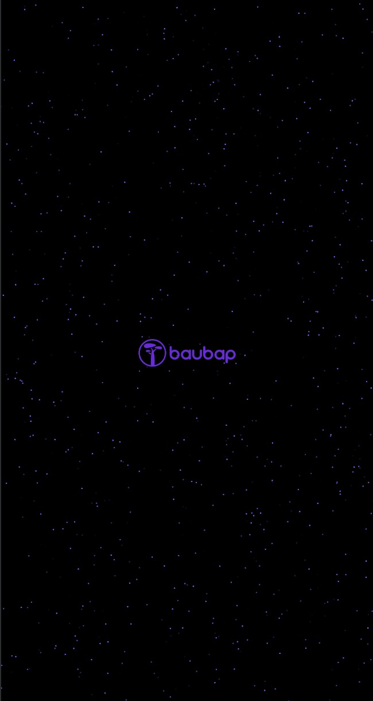

# Detalles de la Aplicación

## Descripción

La aplicación móvil recopila las siguientes funcionalidades:

- Splash
- Login
- Home
    - Estado de cuenta
    - Perfil de usuario
        - Cerrar sesión

### Screnshots

#### Light Theme
| Splash                                    | Login                                   | Home                                  | Profile                                     |
|-------------------------------------------|-----------------------------------------|---------------------------------------|---------------------------------------------|
|  |  |  |  |

### Dark Theme
| Splash                                   | Login                                  | Home                                 | Profile                                    |
|------------------------------------------|----------------------------------------|--------------------------------------|--------------------------------------------|
|  |  |  |  |

### Video
[video.webm](https://github.com/go-cristian/compose-multimodule/assets/4701682/fe419e60-b1f1-4892-bd53-be8d9298188e)

## Arquitectura

La arquitectura de la aplicación sigue el patrón MVVM (Modelo-Vista-ViewModel), facilitando la
separación de preocupaciones y la escalabilidad del código. Se ha adoptado un enfoque modular que
permite una fácil incorporación de nuevas funcionalidades y una mejor organización del código. Cada
módulo cuenta con su propio ViewModel, fomentando así la cohesión y la reutilización del código.

### Sistema de Diseño

El módulo ds alberga el sistema de diseño de la aplicación, que incluye estilos y componentes
compartidos. Estos elementos son fundamentales para mantener la coherencia visual y la experiencia
del usuario en toda la aplicación. Los estilos y componentes del sistema de diseño se integran de
manera transparente en los diferentes módulos de la aplicación, garantizando una apariencia y
comportamiento uniformes.

### Tecnologías

La aplicación hace uso de diversas tecnologías de vanguardia para ofrecer una experiencia de usuario
moderna y eficiente:

- Jetpack Compose: Se utiliza como el kit de herramientas de IU principal para la construcción de
  interfaces de usuario declarativas y reactivas. Jetpack Compose simplifica el desarrollo de la
  interfaz de usuario y mejora la eficiencia del desarrollo.
- Dagger Hilt: Se emplea como un contenedor de inyección de dependencias (DI) para gestionar la
  creación y la resolución de dependencias en toda la aplicación. Dagger Hilt facilita la escritura
  de código modular y la inversión del control, lo que resulta en un código más limpio y mantenible.
- Coroutines: Se utilizan para facilitar la concurrencia y la administración de tareas asíncronas.
  Las coroutines proporcionan un enfoque estructurado y declarativo para el manejo de operaciones
  asíncronas, mejorando la legibilidad y la mantenibilidad del código.

> [!TIP]
> Aunque no se usa Flow en este caso particular debido a la simplicidad de los requerimientos, es
> importante destacar que su potencial para operaciones de streaming podría ser explorado en casos más
> complejos.

- JUnit y Robolectric: Se emplean para la escritura y ejecución de pruebas unitarias y de
  integración. Las pruebas unitarias y de integración son fundamentales para garantizar la calidad y
  la estabilidad del código, y JUnit y Robolectric proporcionan herramientas poderosas para este
  propósito.
- Material3: Se utiliza como el sistema de diseño oficial de Material Design de Google. Material3
  proporciona pautas de diseño actualizadas y componentes predefinidos que se integran perfectamente
  con Jetpack Compose, facilitando la creación de una interfaz de usuario moderna y coherente.

Esta combinación de tecnologías permite construir una aplicación robusta, escalable y fácil de
mantener, que ofrece una experiencia de usuario fluida y atractiva.

### Pruebas

La aplicación cuenta con una suite de pruebas unitarias y de integración que cubren los casos de uso
más importantes. Estas pruebas son fundamentales para garantizar la calidad y la estabilidad del
código. Se han utilizado herramientas como JUnit y Robolectric para este propósito. Las pruebas se
ejecutan automáticamente en cada compilación, permitiendo detectar y corregir rápidamente posibles
problemas.

> [!IMPORTANT]  
> Debido a limitaciones de tiempo, no se extendió el uso de pruebas a todo el código, pero el mismo
> patrón puede ser utilizado en los módulos restantes. Como referencia, se puede tomar el módulo
> dashboard, que cuenta con pruebas unitarias y de integración.

#### Pruebas de UI

Se han implementado pruebas de interfaz de usuario (UI) utilizando la biblioteca de pruebas de
Jetpack Compose. Estas pruebas permiten verificar el comportamiento y la apariencia de la interfaz
de usuario en diferentes escenarios, como la existencia de datos cuando el ViewModel procesa la
información correctamente o no.

#### Pruebas de Casos de Uso

Mediante Robolectric se ha podido hacer shadow de componentes como datasotre, así mismo podría
usarse para testear componentes relacionados con el uso de bases de datos local. En este caso,
Robolectric permite testear de manera unitaria componentes que se comunican con elementos propios de
Android.

### Documentos

Esta app se basa en algunos documentos que he escrito los cuales relacionan los siguientes contenidos:
- [Animación tipo Shimmer](https://cristian-code.medium.com/skeleton-ui-in-jetpack-compose-the-lost-design-f99b5e2f14a1)
- [Manejo de temas light/dark](https://levelup.gitconnected.com/theme-management-with-datastore-in-jetpack-compose-c10c043ab276)
- [Animacion de splash](https://cristian-code.medium.com/jetpack-compose-space-animation-c49fdefcb7a3)
